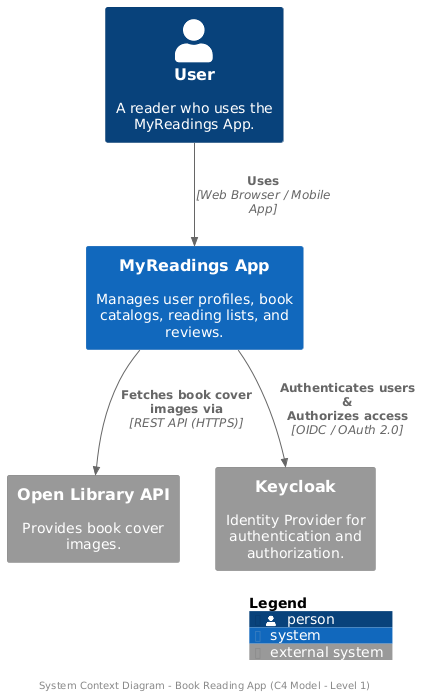
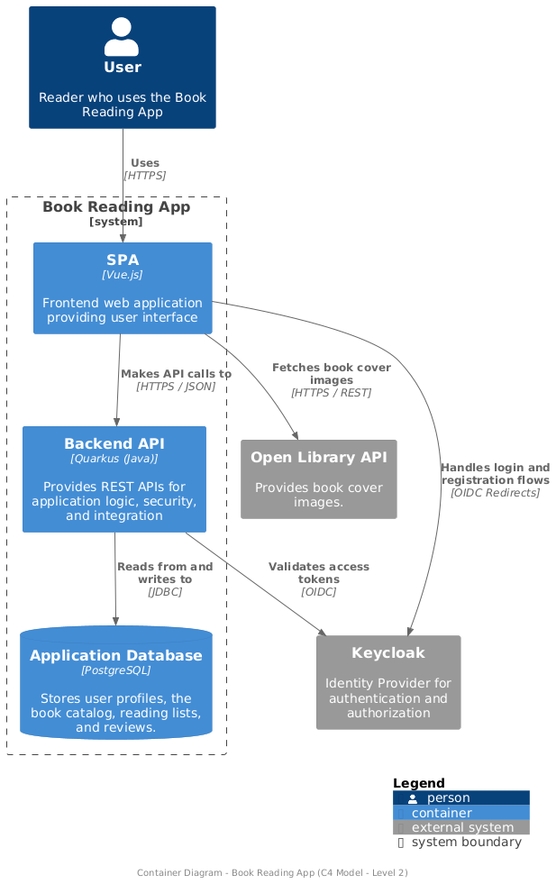
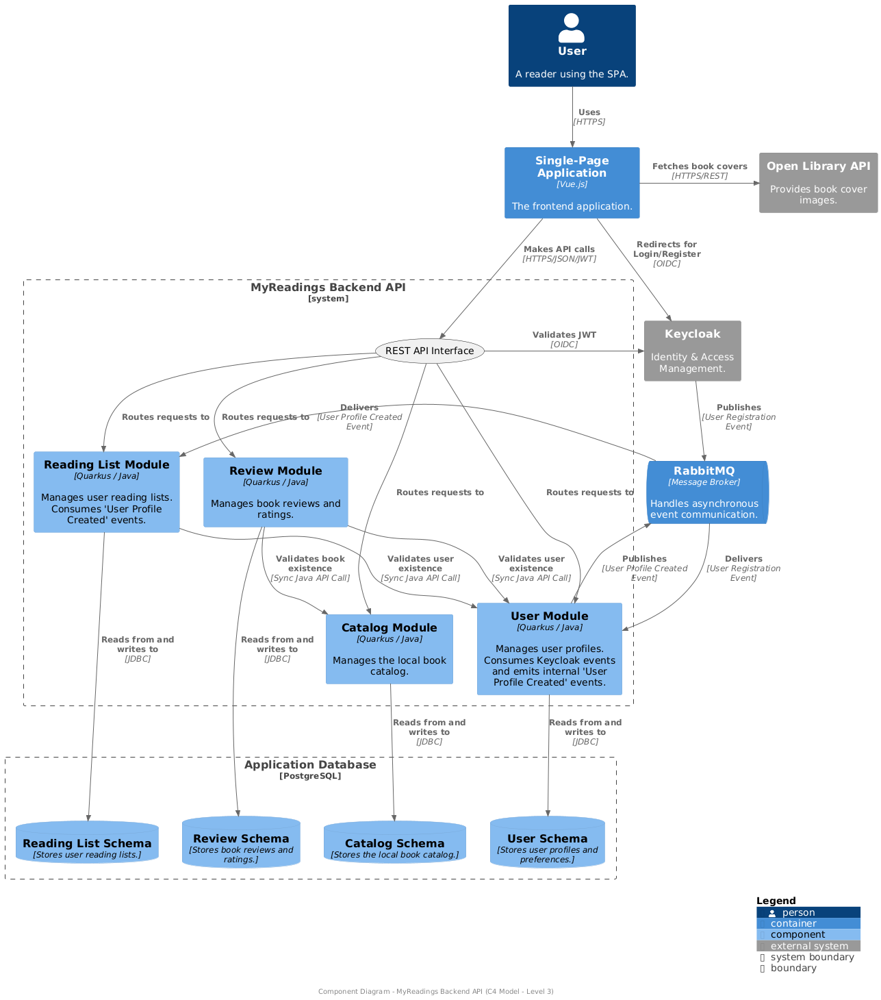

# MyReadings - Modular Backend

This repository contains the source code for the MyReadings backend application. It is a modular monolith built with Quarkus, serving as the API layer for the entire MyReadings ecosystem. It handles all business logic, data persistence, and communication with external services like the identity provider.

This repository is one of the three main components of the project:

- `myreadings` (this repo): The modular backend built with Quarkus.
- `myreadings_ui`: The frontend built with Vue.js.
- `myreadings_deploy`: The infrastructure and provisioning configuration.

## Architecture

This project is designed as a modular monolith, where different business domains are separated into distinct Maven modules. This approach promotes clean separation of concerns and allows for a potential future migration to a microservices architecture.

The main modules are:

- **`common-utils`**: Shared utilities like security filters and exception handlers.
- **`user`**: Manages user profiles, preferences, and consumes user registration events.
- **`catalog`**: Manages the book catalog.
- **`readinglist`**: Manages user-specific reading lists (e.g., "To Read," "Read").
- **`review`**: Manages user reviews and ratings for books.
- **`application`**: The main executable module that aggregates all other modules and exposes the final REST API.

### C4 Model Diagrams

The application architecture is documented following the C4 model to provide different levels of abstraction. The source files for these diagrams are located in the /doc/C4 directory.

#### Level 1: System Context

This diagram shows how the MyReadings App fits into its operating environment, including key external dependencies.



#### Level 2: Container Diagram

This diagram zooms into the system boundary, showing the high-level technical containers that make up the application (frontend, backend, database, etc.).



#### Level 3: Component Diagram

This diagram zooms into the Backend API, showing the internal modules and how they interact with each other and with the database schemas.



## Technology Stack

- **Framework**: [Quarkus](https://quarkus.io/ "null")
- **Language**: [Java 21](https://www.oracle.com/java/ "null")
- **Build Tool**: [Apache Maven](https://maven.apache.org/ "null")
- **Database**: [PostgreSQL](https://www.postgresql.org/ "null") with [Quarkus Panache](https://quarkus.io/guides/hibernate-orm-panache "null")
- **Authentication**: [OpenID Connect (OIDC)](https://openid.net/connect/ "null") with [Keycloak](https://www.keycloak.org/ "null")
- **Messaging**: [SmallRye Reactive Messaging](https://smallrye.io/smallrye-reactive-messaging/ "null") with [RabbitMQ](https://www.rabbitmq.com/ "null")
- **Testing**: [JUnit 5](https://junit.org/junit5/ "null"), [RestAssured](https://rest-assured.io/ "null"), and [Mockito](https://site.mockito.org/ "null")

## Project Setup and Development

This project supports two primary development workflows. For a full-stack demonstration, please refer to the `myreadings_deploy` repository. The workflow below is optimized for backend development.

### Prerequisites

- Java 21 (or a compatible JDK)
- Apache Maven 3.8+
- Docker and Docker Compose

### Local Development Workflow (Hot-Reloading Backend)

This is the recommended workflow for actively developing and debugging the backend.

**Step 1: Start the Infrastructure** The complete infrastructure (Keycloak, PostgreSQL, RabbitMQ, etc.) is managed in the `myreadings_deploy` repository. Please follow the instructions in its `README.md` to launch the `dev` profile.

**Step 2: Start the Backend in Dev Mode** Navigate to the `application` module within this repository and run Quarkus in development mode. The command sources the necessary environment variables to connect to the Docker containers via `localhost`.

    # From the 'myreadings' backend root directory
    # Load environment variables and start Quarkus dev mode
    (set -a; source ../myreadings_deploy/.env; source ../myreadings_deploy/.env.local; set +a; ./mvnw package quarkus:dev -DskipTests=true)

The application will start, connect to the running Docker containers, and enable hot-reloading for live code changes.

**Step 3: (Optional) Start the Frontend** The frontend application is managed in the `myreadings_ui` repository. To interact with the backend through the UI, follow the instructions in its `README.md` to start the local development server.

## Testing Strategy

This project follows a comprehensive testing strategy to ensure code quality and correctness.

### Unit & Integration Tests

The test suite includes both fast, isolated **Unit Tests** (`*UnitTest.java`) that use mocking, and more comprehensive **Integration Tests** (`*IntegrationTest.java`). The integration tests use `@QuarkusTest` and leverage **Quarkus Dev Services** to automatically spin up temporary containers for dependencies.

To run the entire suite, execute the standard Maven `test` command from the root of this repository.

    # From the 'myreadings' root directory
    ./mvnw test

### Code Coverage

To run all tests and generate a complete code coverage report, use the Maven `verify` lifecycle phase. This will execute all unit and integration tests and then aggregate the results using JaCoCo.

```bash
# From the root directory
./mvnw clean verify
```
